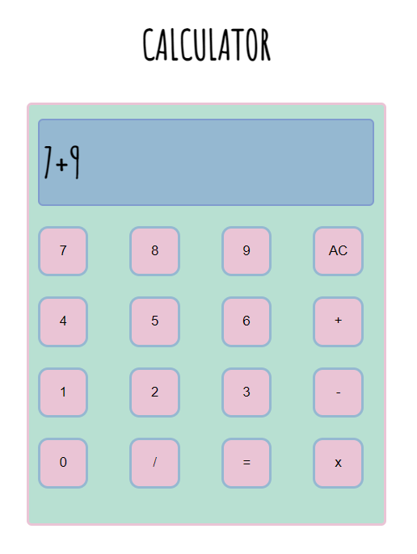

Calculator website is created with using HTML, CSS and JavaScript.

## TABLE OF CONTENTS
#
* General Info
* Technologies
* Launch

### General Info
#
Calcultor is a simple website, which helps you too perform basic arithmetic operation like addition, subtraction, division, multiplication.

### Technologies
#
* HTML
* CSS
* JavaScript

### Launch
#
To use Calculator or to see website. Please click on the deployed link below.

[Calculator](https://calculatorprojectapp.netlify.app/)

